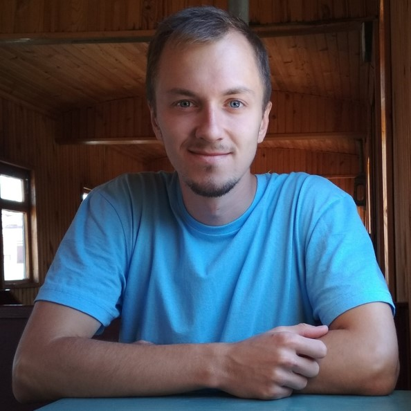

# CV by Dmitrii Snitkin

## My name

Snitkin Dmitrii Vladimirovich

## Contacts

+7 923 252 19 14

snitkin.d@list.ru

https://vk.com/am_unavailable

## About me

For a long time, I have been working as biologist, but I understood that I love coding and making interesting features. Due to coronavirus quarantine, I was locked at my home and was coding day and night. I learned so fast that soon the result has materialized in form of my website https://bilinguator.com. Now I want to change my profession to web development. For this, I lost my job and started serious study in the Rolling Scopes School.

## Job experience

### 1. R-Pharm

Period: 01.2017–04.2018

Website: http://r-pharm.com/

City: Yaroslavl

Position: **Biotech engineer**

Description:
- Development of production documentation, approbation and revision during the technological process.
- Participation in all stages of the technological process of mammalian cells cultivation from small flasks to bioreactors with a volume of 2000 liters.
- Auxiliary procedures for sampling and analysis, preparation of solutions and culture media on industrial equipment.
- Work in accordance with international GMP standards in aseptic conditions.

### 2. Vector-Best

Period: 04.2018–07.2018

Website: https://vector-best.ru/

City: Novosibirsk

Position: **Junior research associate**

Description:
- Planning and conducting experiments to determine the optimal conditions for the cultivation and transfection of mammalian cells.
- Maintenance of cell cultures, defrosting, freezing, storage in a cryostorage.
- Metal chelate chromatography, tangential flow filtration, restriction and electrophoresis of plasmid DNA.

### 3. Institute of Highly Pure Biopreparations

Period: 04.2019–02.2020

Website: https://hpb.spb.ru/ru/

City: Saint Petersburg

Position: **Biotechnologist**

Description:
- Planning and conducting experiments on the cultivation of mammalian cells in desktop bioreactors of small volumes.
- Enzyme immunoassay

### 4. Saint Petersburg State University

Period: 03.2020–09.2020

Website: https://spbu.ru/

City: Saint Petersburg

Position: **Researcher**

Description:
- Laser scanning confocal microscopy.
- Adherent cultivation of eukaryotic cells.

## Skills

Basic skills in: HTML, CSS, JavaScript, JQuery, PHP, Ajax, API.

## My projects

My main project is https://bilinguator.com website.

## Education

Specialist Degree

Period: 2010–2015

University: Demidov Yaroslavl State University

Specialization: **Biology**

Professional retraining

Period: 2016–2017

University: Demidov Yaroslavl State University

Specialization: **Programming and administration of information systems** (Java, C#, MS SQL, etc.)

## English

Level (according to EPAM Training Center): **B1**.

Two-weeks practice in England

Period: 01.2014–02.2014

Organization: Eastbourne School of English

Website: https://www.elc-schools.com/
